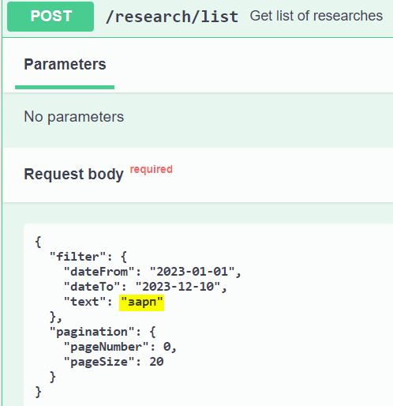
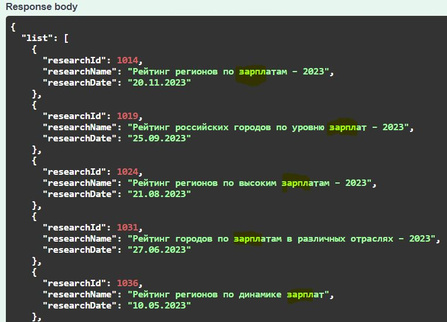
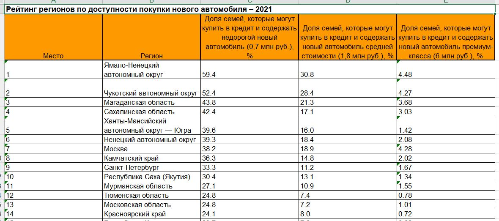

# ria-rating-report
This application could help in sociological studies of the differences of the regions of the Russian Federation.
It analyzes studies conducted by RIA Rating agency (https://riarating.ru/), fills the database with them and can build a report from these data.

> Java 11, Spring Boot, Lombok, Jsoup, Apache Poi, Hibernate, Postgres, Flyway, Swagger

## Search in Swagger example:

## Report example:

You can read an example of the 2021 report here: [ria-rating-report-2021.xls](src/main/resources/readme/ria-rating-report-2021.xls)

## Launch:
To run the application, you should clone the project, build it with Gradle, and prepare a Postgres database. 
You should also specify the database credentials in the config [application.yaml](src/main/resources/application.yaml).
If you haven`t, you can quickly install the database by using docker and running next command in the console, replacing some data before:
> docker run --name testdb-pg -p 5432:5432 -e POSTGRES_USER=pguser -e POSTGRES_PASSWORD=passwd123 -e POSTGRES_DB=testdb -d postgres:14.5 
